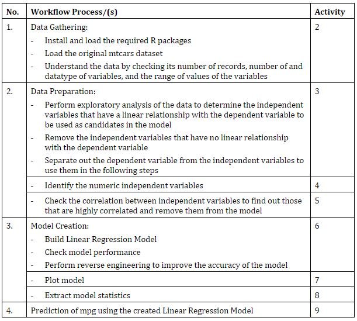
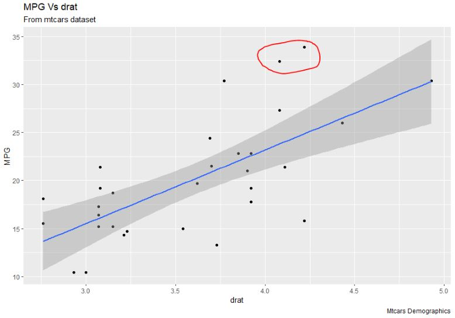
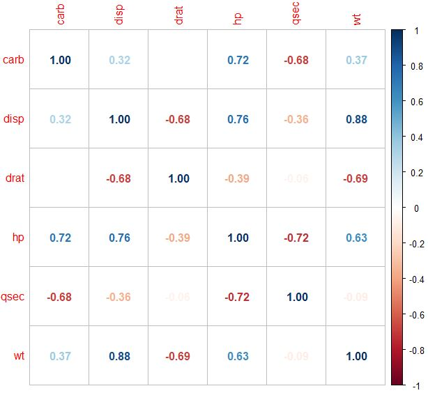
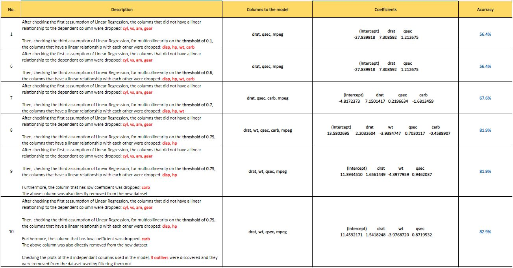
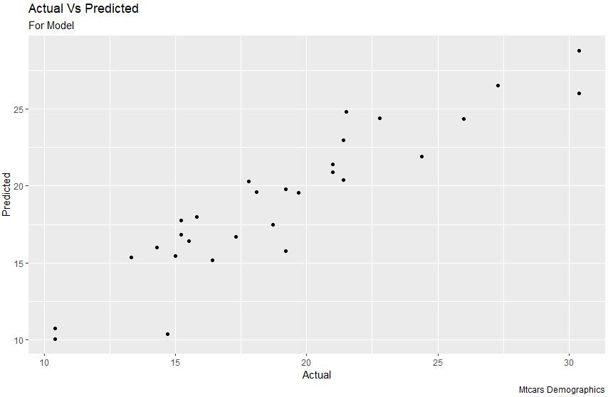

# Forecast Model for MPG

### Info
- **Module:** Basic R Programming
- **Tools Used:**
  - RStudio
    - R Packages (ggplot2, car, caret, corrplot)
  - Microsoft Excel
- **Assets:**
  - [_BRP-R-Codes_](./source/BRP-R-Codes.Rmd) (R code file)
  - [_images_](./images) folder (Misc. image files)

### Description  
In this project, analysis is performed on the ***MTCARS*** dataset to investigate if there is a linear relationship between ***MPG*** (dependant variable) and the other independant variables.

After checking for the assumptions of Linear Regression, a Linear Regression model is created and fine-tuned. The forecast model for ***MPG*** is thus completed.

### Background
***MTCARS*** dataset (Motor Trend Car Road Tests) is a built-in dataset in R derived from the 1974 Motor Trend US magazine, comprising of fuel consumption and 10 aspects of automobile design and performance for 32 automobiles (1973-1974 models).

***MPG*** stands for ***M***_iles_ ***P***_er_ ***G***_allon_ and is the main indicator of performance of an automobile which the project aims to predict.

Once the Linear Regression model is built, the ***MPG*** value can be predicted when given the values of the other independant variables used in the model.

### Sample Work
**Project Workflow**  


**R Code and Details (some snippets)**  

- **When checking for linear relationship between the dependant variable and independant variables, plots are created and some outliers are detected**

```r
# 4. MPG vs drat (Linear relationship)
ggplot(data=mtcars, aes(x=drat, y=mpg)) +
geom_point() + geom_smooth(method="lm") +
labs(title="MPG Vs drat", subtitle="From mtcars dataset", y="MPG", x="drat", caption="Mtcars Demographics")
```



The scatterplot shows that there is a linear relationship between ***MPG*** and drat (Rear axle ratio). Also, 2 outlier data points are detected and subsequently removed in the final dataset used to build the linear regression model.</br></br>

- **Checking for correlation between independant variables to be used in the linear regression model**

```r
x_mat_cor <- cor(x_numeric_var)
corrplot(x_mat_cor, method="number", order="alphabet")
```



The higher the colour saturation of the shown values, the higher the correlation between the 2 independant variables (one from the column **vs** another one from the row).

Multicollinearity occurs when two or more pairs of independant variables have a high correlation with one another. This is bad for the linear regression model as it undermines the statistical significance of those independent variables.</br></br>

- **Creating and fine-tuning the Linear Regression Model**

```r
Threshold <- 0.75    # Threshold from -0.75 to 0.75

x_high_corr_cutoff <- findCorrelation(x_mat_cor, cutoff=Threshold)
x_high_corr_cutoff_colnames <- colnames(x_mat_cor)[x_high_corr_cutoff]

x_high_corr_cutoff_colnames

# Removing columns that are highly correlated
x_new <- x_numeric_var[, -which(colnames(x_numeric_var) %in% x_high_corr_cutoff_colnames)]

# Removing the carb column from x_new as its coefficient is very close to 0, which means
# it is not important for the model (checked in reverse engineering)
x_new <- x_new[,c(-4)]

model <- lm(y ~ ., data=x_new)
# model <- lm(y ~ drat + wt + qsec, data=x_new)
summary(model)

coefficients <- model$coefficients
coefficients
```

Using the above code, reverse-engineering  is performed to improve the accuracy of the linear regression model (since it is a multiple linear regression model, the adjusted r-squared value is used for the accuracy value).



The final linear regression model created has an accuracy of 82.9% and a scatterplot of actual **vs** predicted ***MPG*** values shows that the model is quite good.

```r
Predictions <- predict(model, x_new)
Actual <- y

final <- cbind(x_new, Actual, Predictions)
final

# Plot for Actual Vs Predictions
ggplot(data=final, aes(x=Actual, y=Predictions)) + 
geom_point() + 
labs(title="Actual Vs Predicted", subtitle="For Model", y="Predicted", x="Actual", caption="Mtcars Demographics")
```



### Conclusion
A program in R is written using RStudio to create a Linear Regression model which can be used to predict the ***MPG*** value of cars (which is used as a performance indicator of cars). 